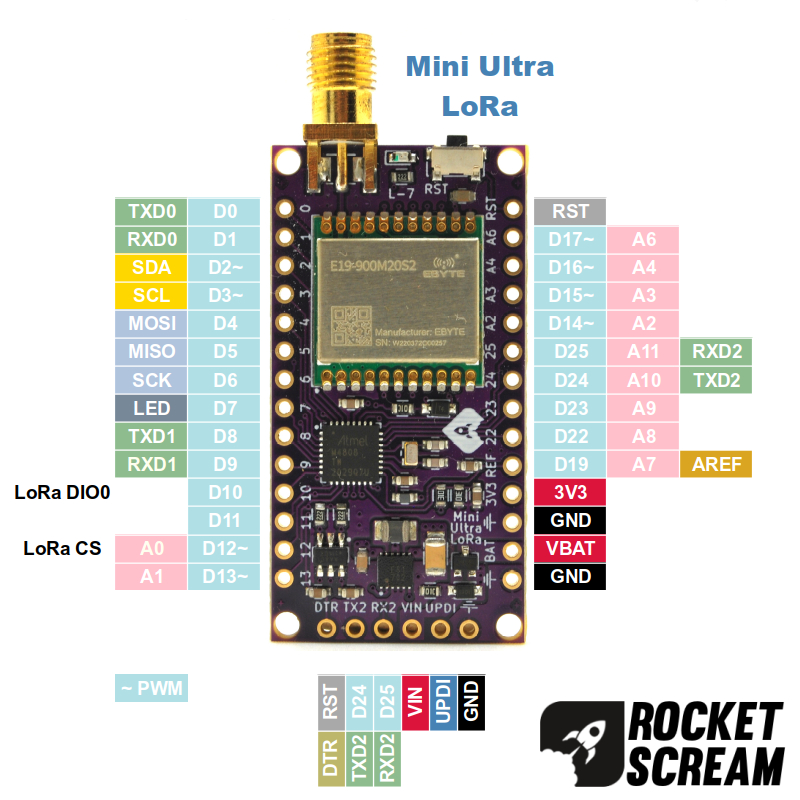

# Mini Ultra LoRa

Mini Ultra LoRa is an Arduino compatible ATmega4808 board that is suitable for ultra low power wireless applications. During deep sleep mode, the board consumes only 5 uA (with the on-board radio module in sleep mode) when powered by a 3.6 V source. The board comes equipped with a 2Kb I2C serial EEPROM with pre-programmed EUI-64™ MAC ID 24AA025E64T chip to be used as DEVEUI in a LoRaWAN network and E19-900M20S2 LoRa radio module. Option to use various battery type, cell combination and chemistry such as 2xAA or 3xAA (alkaline, NiMH), CR123A, LiFeFO4, and Li-Ion/Pol. No charger IC is included on-board.
